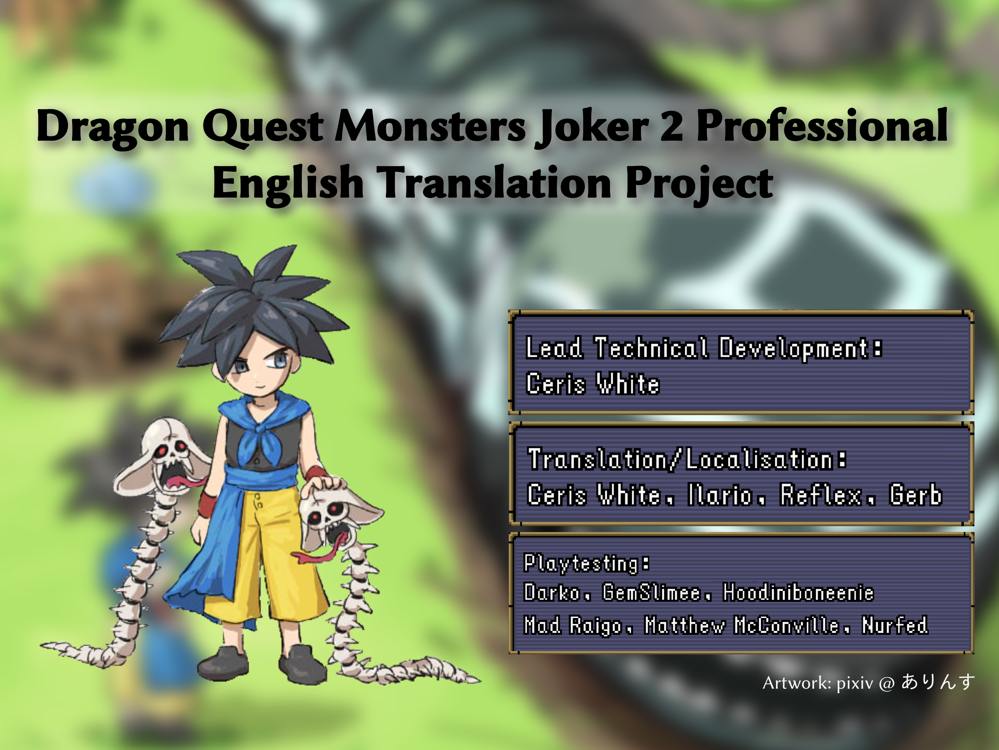

This fork of Ceris White's Joker 2 Professional repository includes a post-game translation by Gerb.

Before patching: [New synthesis recipes](https://github.com/saneezore07/DQMJ2Pro_Translation/blob/master/Guide/adding_new_synths.md) has been added to the game for monsters that exist in the game files, but were either wi-fi exclusive monsters or otherwise not obtainable in gameplay.

[Guide](https://github.com/saneezore07/DQMJ2Pro_Translation/blob/master/Guide/step-by-step.md) to patch your legally obtained rom. [Linux](https://github.com/saneezore07/DQMJ2Pro_Translation/blob/master/Guide/linux_guide.md). 
Note: The windows guide tells the patcher to independently source `ndstool.exe`. Since `ndstool` is a [GPL3](https://github.com/saneezore07/DQMJ2Pro_Translation/blob/master/Database/ndstool_license_COPYING.gpl3)+[MIT](https://github.com/saneezore07/DQMJ2Pro_Translation/blob/master/Database/ndstool_license_COPYING.mit) project, a compiled windows binary has been provided in this repository, dated to March 2026.

Database of Monster [Synthesis](https://github.com/saneezore07/DQMJ2Pro_Translation/blob/master/Database/synthesis_database.csv) Recipes. 
Databse of Monster [Stats and Traits](https://github.com/saneezore07/DQMJ2Pro_Translation/blob/master/Database/monster_database.csv). 
Databse of Monster [Resistances](https://github.com/saneezore07/DQMJ2Pro_Translation/blob/master/Database/monster_resistance_database.csv).

Eugene Pool (the old man on the airship) missing is an anti-piracy measure (among others) by the developers. 
This can be circumvented by [pre-applying an anti-piracy (AP) patch](https://github.com/saneezore07/DQMJ2Pro_Translation/blob/master/Guide/ap_patching.md) before apply the translation patch. 
This happens on hardware (DS, 3DS), but not emulation (desume, melonDS)

---

You will need the J2P ROM, BLZ, ndstool (<https://github.com/devkitpro/ndstool>), and python. A compiled build of BLZ is provided for Windows as blz_win.exe; The scripts expect it to be named blz.exe when used.
You will have to find a compiled ndstool or build it yourself.
The ndstool command I usually use comes out to this (inside of a `Pro_ROM` folder):
`../ndstool -x ../DQMJ2P.nds -7 arm7.bin -9 arm9.bin -d data_dir -y overlay_dir -t banner.bin -h header.bin -y7 y7.bin -y9 y9.bin -t banner.bin -o logo.bin`
and to make the new ROM after changing things:
`../ndstool -c ../edited.nds -7 arm7.bin -9 arm9.bin -d data_dir -y overlay_dir -t banner.bin -h header.bin -y7 y7.bin -y9 y9.bin -t banner.bin -o logo.bin`

- arm9tool.py: Compresses and decompresses the arm9.bin file; You will need to put a copy of the decompressed arm9.bin in Pro_Tools as Pro_ARM9.bin for msgtool to work. `python Pro_Tools/arm9tool.py decompress Pro_ROM/arm9.bin Pro_Tools/Pro_ARM9.bin`
- find_untranslated.py: `python Pro_Tools/find_untranslated.py <directory>` will list every file with JP characters inside it. Use with `-v` to print the exact line numbers and strings themselves.
- msgtool.py: extracts strings. `python Pro_Tools/msgtool.py extract Pro_ROM/data_dir STRINGS/` will extract the msg files to a new STRINGS directory. `python Pro_Tools/msgtool.py repack STRINGS/ OUTPUT/` will rebuild the files to OUTPUT
- storytool.py: extracts scripts. `python Pro_Tools/storytool.py disasm Pro_ROM/data_dir SCRIPTS/` will extract the script files to a new SCRIPTS directory. `python Pro_Tools/storytool.py asm SCRIPTS/ OUTPUT/` will rebuild the files to OUTPUT

Extract the strings and scripts, edit them, rebuild them to OUTPUT, copy the contents of OUTPUT to data_dir (`cp OUTPUT/* Pro_ROM/data_dir/`) and then rebuild with ndstool. Finally, test your changes by running edited.nds in your emulator of choice.

Newly added:
- apply_patches.py: Provides an interface for applying patches to the ROM directory, including the above and some other optional patches.
- performpatch.py: Automatically applies the necessary patches + swaps the gender icons for polarity icons, then builds the translated files for you. For people who only want to play the translated game.
